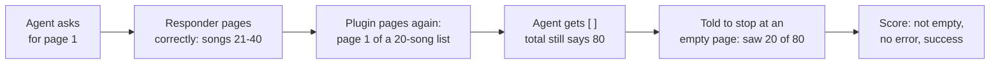
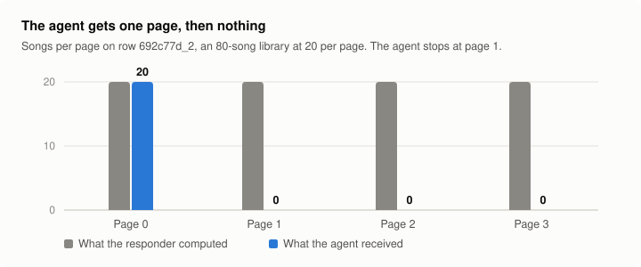
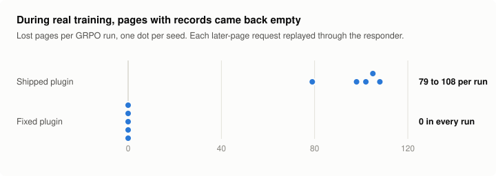
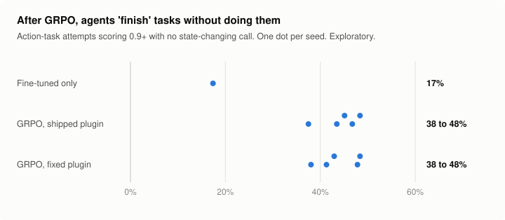

# WorldCheck

Some AI agents are trained inside a simulator instead of the real software: the agent asks a fake
Spotify for its songs, the simulator answers, and a score says how well it did. Patronus AI published
one of these for the AppWorld benchmark in
[`patronus-ai/mdlm_world_modeling`](https://github.com/patronus-ai/mdlm_world_modeling). This repo
checks it, on their own code and data, at commit `58e6fe0c`.

**What I found, in one breath:** the simulator hides every page of a list after the first, the score
can't tell, and when you actually train through it, the agents learn to declare tasks done without
doing them.



## Check it yourself

```sh
uv venv && uv pip install -r requirements.txt
PYTHONPATH=. .venv/bin/python -m pytest tests/ -q
```

Three pure-python packages, a few seconds, no GPU. The first run fetches the two pinned upstream repos
(about 100MB) into `.upstream/`.

## 1. Every page after the first comes back empty

The simulator's "responder" pages a list correctly. The training plugin then pages that already-paged
answer a second time, so page 1 onward is always empty while `total` still reports the full count. The
agent is told to keep asking until a page is empty, so it stops after one.

<picture>
  <source media="(prefers-color-scheme: dark)" srcset="figures/pages-dark.svg">
  
</picture>

| Step | Where | What happens |
|---|---|---|
| Responder pages correctly | `appworld_wm_prompt.py:313-315` | `start = page_index * page_limit` over the matching records |
| Plugin pages again | `appworld_plugin.py:421-422` | the same slice, applied to a list that is already one page |
| Agent stops early | `appworld_prompt.py:36` | "increment page_index until the response is empty" |

It reaches all 34 of 34 training tasks, and it is on by default (`appworld_plugin.py:372`).

<details>
<summary>More evidence: not a cache bug, a better model wouldn't fix it, and smaller problems</summary>

- **Not a stale cache.** The very first request for page 1, with nothing cached, is also empty and
  still reports `total: 80`.
- **It also mislabels.** Ask for page 1 first, then page 0, and page 0 comes back holding page 1's songs
  (ids `217, 317, 95, ...` instead of `311, 36, 12, ...`).
- **A better world model wouldn't fix it.** The upstream README marks the responder "(optional - worth
  ablation)". Turning it off, with a stub world model that returns exactly the right records, still
  loses every page after the first:

  | Version | Tasks read in full | Records seen, on average |
  |---|---|---|
  | Responder on, as shipped | 0 of 30 | 20.0 of 60.4 |
  | Responder on, patched | 30 of 30 | 60.4 of 60.4 |
  | Responder off, perfect stub | 0 of 30 | 20.0 of 60.4 |

  The paper (Section 5) expects pagination drift "to improve as MDLM scaling and tool-use centric
  post-training continues to mature." This part of it lives in the plugin, so scaling never reaches it.
  It is a different symptom from the paper's Table 7 (i), which is repeated pages, not empty ones.
- **Single records get truncated.** The plugin re-pages the first list inside *any* response, so
  playlist 300 comes back with 5 of its 8 songs.
- **The two layers disagree on edge cases.** `page_limit=0` gives 0 records from the plugin and 1 from
  the responder; `page_index=-1` gives 0 and 20.
- **Not a bug, but worth knowing.** Writes are acknowledged without changing what later reads return.
  The paper's Appendix G documents this as intended, so it is recorded, not reported.
- **A separate data issue.** 16 of the 34 tasks advertise more records than they list, 1,992 in all
  (the worst says 169 and lists 30). No pagination fix can recover those.

</details>

## 2. The score can't tell

The score counts a response as a success if it isn't empty and doesn't say "error"
(`appworld_plugin.py:583-584`). An empty page with a total attached passes. For questions with one right
answer, it checks whether the right answer appears *anywhere* in the reply (`appworld_plugin.py:666`).

| What the agent did | Score from the unmodified `AppWorldReward` |
|---|---|
| Saw 20 of 80 songs, through the shipped plugin | 0.0105 |
| Saw all 80 songs, with correct paging | **0.0105**, identical |
| Answered "0 1 2 ... 100" to a counting question | **1.0**, on all 6 counting tasks |
| Answered "124" when the truth is 24 | **1.0**, on all 6 |
| Answered 25 when the truth is 24 | about 0.24 |

<details>
<summary>Details</summary>

- The small absolute values in the first two rows come from hand-built sweeps that skip the credential
  steps the score also rewards. The point is that the two are equal, not their size.
- Pasting every title from the first page of each Spotify list scores 1.0 on 2 of the 5 name questions.
  The other 3 answers sit past the first page, which the shipped plugin never shows.
- These are hand-built answers. Whether training actually finds them is checked in section 3: it
  didn't, at this size.

</details>

## 3. What happens in real training

I ran Patronus's own recipe for real: fine-tuning on their demonstrations, then GRPO reinforcement
learning, on the smallest agent in their paper (LFM2.5-1.2B). Once through the shipped plugin and once
through the fixed one, five seeds each, everything else identical.

**The bug fires constantly.** In every shipped run, about a hundred pages that held records came back
empty. In the fixed runs, none.

<picture>
  <source media="(prefers-color-scheme: dark)" srcset="figures/lost-pages-dark.svg">
  
</picture>

**Yet the trained agents came out the same.** Training worked (average score rose from 0.39 to 0.60),
but equally in both versions, and no measure declared before the runs separated them.

**What training did learn was to skip the work.** On tasks that need a change, like rating songs or
accepting payment requests, the trained agents mostly logged in, looked around and declared the task
done. The score pays that almost full marks.

<picture>
  <source media="(prefers-color-scheme: dark)" srcset="figures/skip-work-dark.svg">
  
</picture>

If the score doesn't need the task done, fixing what the agent sees can't change what it learns. The
fix is necessary but not sufficient; the score is what limits training here. That last chart is
exploratory: it came from reading episodes by hand, not from the plan.

<details>
<summary>How it was run, the full comparison, and limits</summary>

**Setup.** `run_lfm25_sft.sh` then `run_lfm25_sft_grpo_v2.sh`, unchanged except: fine-tuning uses
`appworld_sft_gpt_agent.jsonl` because the file the script names isn't in the repo; `max_length` 16384
instead of 4096 so no demonstration is dropped; the training vLLM gets 0.35 of the GPU instead of 0.5;
TensorBoard instead of Weights & Biases. Their SDAR world model is unreleased, so
`Qwen/Qwen3-4B-Instruct-2507` stands in under the name their proxy expects. It was asked 3 to 29 times
per run out of 3,300 to 3,900 tool calls; the responder answered the rest. torch 2.10.0, vLLM 0.19.0,
transformers 4.57.6, TRL 0.29.1, ms-swift `43b5d8e`. One A100-80GB per run on Modal, about 21 minutes
and $1.15 each; $24.33 in all, $5.74 of it on a cancelled batch that was rerun from scratch.

**The declared comparison.** Each checkpoint ran 8 times on each of the 34 tasks, scored through the
fixed plugin. A difference counts only if its 95% interval excludes zero and 4 of 5 seed pairs agree.

| Measure | Fine-tuned only | Trained, shipped | Trained, fixed | Fixed minus shipped |
|---|---|---|---|---|
| Questions answered exactly right | 0.000 | 0.005 | 0.000 | -0.005 (-0.014 to 0.000) |
| Sweeps that read past page 0 | 0.198 | 0.169 | 0.171 | +0.002 (-0.028 to +0.029) |
| Score | 0.394 | 0.604 | 0.609 | +0.005 (-0.010 to +0.020) |

Nothing passes. Question accuracy could never show an effect at this size: no agent answers the
questions (0 to 2 right out of 440 attempts per group). Scored through the shipped plugin instead,
trained-through-fixed agents read past page 0 3.7 points more often (+0.5 to +6.4, all five seeds
agree), but that was not the declared view and with eighteen comparisons it could be chance.

**The exploratory chart.** Among attempts at tasks that need a change of state: called `complete_task`,
made no call from the responder's own list of state-changing tools (`appworld_wm_prompt.py:384-390`),
and still scored at least 0.9. After training, agents finish 94-95% of these tasks and 91% of those
finishes change nothing; the score averages 0.87 to 0.88 for those, against 0.84 to 0.89 for finishes
that do change something. All 23 action tasks show it. One task (play a song) needs a tool outside that
list; leaving it out moves every rate by at most 2 points.

**Limits.** Scored on the same 34 tasks they trained on, through the simulator, not real AppWorld; the
paper's AppWorld results come from a real-environment evaluation this does not reproduce. One small
agent, one fine-tuning seed. The raw logs contain AppWorld-derived records, so only the aggregates
(`results/grpo_summary.json`) are in this repo.

</details>

## The fix

[`patches/appworld_plugin_pagination.patch`](patches/appworld_plugin_pagination.patch) removes 37 lines
and adds 14. It makes the plugin use the responder's own page window, pick the right list field instead
of the first one it finds, re-page only when a response really is longer than one page, and drop a cache
that stored one page as if it were the whole list.

<details>
<summary>Why the obvious fixes are wrong</summary>

The re-page step stays, because it defends against a world model that returns several pages at once,
which is exactly the paper's Table 7 (i). Deleting the block brings that failure back. Adding
`page_index` to the cache key changes nothing, because the cached value is already a single page.
`test_patched_still_pages_an_overlong_reply` pins the first case. The patch is generated from
exact-text replacements in `worldcheck/fix.py`, each of which must match upstream exactly once.

</details>

## The general question: a practice environment

The AppWorld bug is one case of a broader question: when a simulator makes mistakes, does the training
score still rank a good agent above a bad one? `worldcheck/env/` is a small online store built as real
software (orders, refunds, notes, with the untidy data real systems accumulate), plus a fault injector
that makes a simulated copy go wrong in six ways, three from the paper's Table 7. Nine simple agents
run against both.

With a correct simulator, a score shaped like `AppWorldReward` picks the right best agent. With one that
behaves like the shipped AppWorld path, it scores an agent that reads one page exactly the same as one
that reads everything (0.659 each), although the first fails 3 of 15 tasks in the real store.

<details>
<summary>How it works and the full results</summary>

**The store.** Eight tools over in-memory SQLite, integer cents, a clock that only moves on actions,
snapshot and restore, an append-only audit log. Eight untidy fixtures: a partly refunded charge, a
retried idempotency key, one customer with two accounts, a soft-deleted order the index still counts, a
stale index total, an order just after local midnight, a pending charge, and a note mentioning a
"Traceback" that the upstream score misreads as an error (`appworld_plugin.py:581`). Fifteen tasks,
graded on the final database state.

**Faults** change only what the agent sees: page 0 repeated, later pages empty, an invented record, a
chat-wrapped response, writes acknowledged but not saved, reads that miss earlier writes. **A verifier**
with seven checks catches every injected fault and stays silent on 135 episodes against the real store.

**Agents** are every combination of how they page (page 0 only, until empty, by `total`) and how they
write (once, check first, write then check), declared before any result. Each pair of agents either
agrees with reality, collapses (reality separates them, the score doesn't), is spurious, or is
reversed. Regret is how much worse in reality the score's top pick is than the true best.

| Simulator | Agree | Collapse | Spurious | Reversed | Regret |
|---|---|---|---|---|---|
| Correct | 26 | 0 | 10 | 0 | 0.0 |
| Later pages empty | 12 | 10 | 10 | 4 | 0.2 |
| Page 0 repeated | 9 | 4 | 9 | 14 | 0.2 |
| AppWorld-like | 15 | 14 | 5 | 2 | **0.2** |

A regret of 0.2 is three tasks out of fifteen. All eight simulators and every pair are in
`results/calibration.json`. This measures the instrument and these faults, not any particular world
model; a real one plugs in through one function.

</details>

## Limits

- The training result is one small agent, scored in the simulator. A stronger agent might differ,
  especially on the question tasks this one never answers.
- Nothing here is about Patronus's hosted Digital World Model, only this repository.
- The upstream rows are read from the pinned checkout at run time; this repo copies none of their data.

<details>
<summary>Reproducing, and what's where</summary>

```sh
PYTHONPATH=. .venv/bin/python -m worldcheck.repro          # page sweep, out-of-order pages, clamps
PYTHONPATH=. .venv/bin/python -m worldcheck.reachability   # how much of the training split is affected
PYTHONPATH=. .venv/bin/python -m worldcheck.reward         # what AppWorldReward scores
PYTHONPATH=. .venv/bin/python -m worldcheck.answers        # which answers it gives full credit
PYTHONPATH=. .venv/bin/python -m worldcheck.ablation       # the responder ablation
PYTHONPATH=. .venv/bin/python -m worldcheck.calibrate      # the practice-environment rankings
python3 figures/make.py                                    # the charts, from results/
```

The upstream code runs unmodified with its real `json_repair` and `requests`. No world model is ever
called: `call_world_model` is replaced with a function that raises. The only substitute is four symbols
imported from ms-swift, checked against its source at `43b5d8e` by `tests/test_shim_fidelity.py`; ms-swift
is parsed, never imported. The GPU arm is `gpu/grpo.py` (Modal) and `gpu/analyze.py`.

| Path | What it is |
|---|---|
| `worldcheck/` | The AppWorld measurements, the fix, the practice store, faults, verifier and agents |
| `gpu/` | The training and evaluation job, and its analysis |
| `figures/` | The charts and the script that draws them |
| `patches/` | The fix, generated from `worldcheck/fix.py` |
| `results/` | Committed output of every command above |
| `tests/` | All of the above, as tests |

</details>
